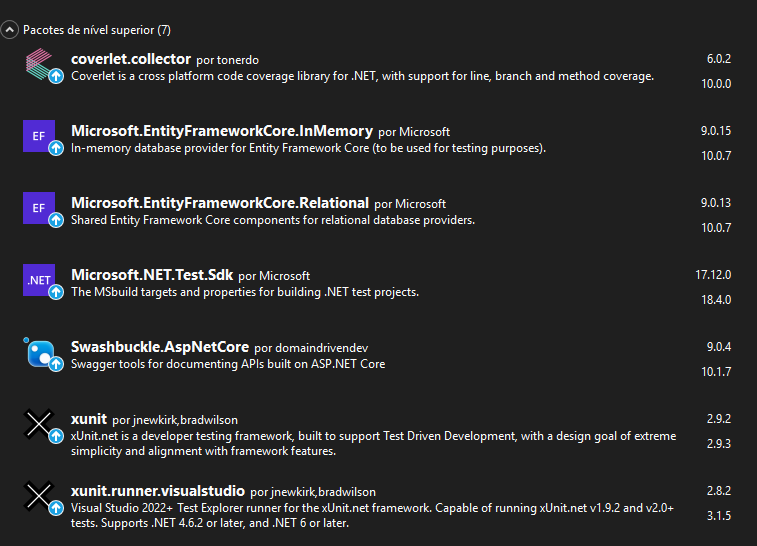
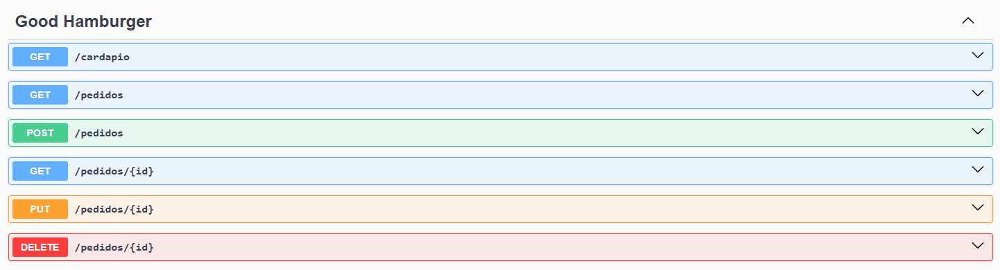
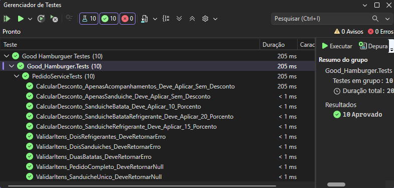

# Good Hamburger Project

Bem-vindo ao Projeto Good Hamburger! 

Neste arquivo README, você encontrará informações úteis sobre o funcionamento do projeto.

## Índice

- [Sobre](#sobre)
- [Tecnologias e Frameworks](#tecnologias-e-frameworks)
- [Decisões de Arquitetura](#decisões-de-arquitetura)
- [Em funcionamento](#em-funcionamento)
- [Conclusão](#conclusão)

## Sobre

Este é um projeto de desafio tecnico simples com o objetivo de criar uma API com ASP.NET Core para gerenciar os pedidos de uma lanchonete ficticia.

Requisitos:
- Construção de uma API REST em C# com .NET / ASP.NET Core.
- Implementação do CRUD completo: criar, listar, consultar por identificador, atualizar e remover.
- Implementar calculo de desconto, subtotal e total final de cada pedido.
- Validar erros e retornar respostas claras (ex.: itens duplicados, pedido inválido, recurso não encontrado).

Regras de desconto:
- Sanduíche + batata + refrigerante aplicar 20% de desconto.
- Sanduíche + refrigerante aplicar 15% de desconto.
- Sanduíche + batata aplicar 10% de desconto.
- Cada pedido pode conter apenas um sanduíche, uma batata e um refrigerante. 
- Itens duplicados devem retornar uma mensagem de erro clara.

Diferenciais (opcionais):
- Frontend em Blazor consumindo a API.
- Testes automatizados das regras de negócio.

## Tecnologias e Frameworks 

Neste projeto, foi utilizado as seguintes tecnologias:

- C# 
- .NET 9
- ASP .NET
- xUnity
- EntityFrameworkCore
- Swashbuckle (Swagger)

## Decisões de Arquitetura

A aplicação foi construída como uma **API REST em ASP.NET Core seguindo o conceito de Minimal APIs**, por ser um escopo pequeno priorizei a simplicidade, legibilidade e baixo custo de manutenção.

### 1. Minimal APIs
Os endpoints foram organizados em classes de extensão, como `CardapioEndpoints` e `PedidosEndpoints`, o que mantém o `Program.cs` limpo e facilita a separação por responsabilidade funcional.

### 2. Entity Framework Core com banco em memória
O projeto utiliza `EntityFrameworkCore` com `UseInMemoryDatabase`, permitindo execução rápida e simples, sem dependência inicial de um banco de dados externo.

Além disso, o `AppDbContext` também centraliza o seed inicial do cardápio e o mapeamento do relacionamento entre pedidos e itens.

### 3. Separação entre transporte, domínio e regra de negócio
Mesmo sendo um projeto enxuto, foi mantida uma separação básica de responsabilidades:
- **DTOs**: representam os dados de entrada da API, como `CriarPedidoDto`;
- **Models**: representam as entidades de domínio e persistência, como `PedidosModel` e `CardapioModel`;
- **Service**: A classe `PedidoService` foi utilizada para encapsular regras de negócio, como validação dos itens do pedido e cálculo de descontos.

Essa decisão evita que os endpoints concentrem regras de negócio, melhorando a legibilidade e facilitando manutenção futura.

### 4. Estrutura orientada ao domínio do problema
A organização em pastas como `Data`, `Dto`, `Endpoints`, `Model` e `Services` foi adotada para refletir as responsabilidades do sistema de forma simples e direta.  
A ideia foi manter uma estrutura fácil de entender por qualquer pessoa que abra o projeto pela primeira vez.

### 6. Swagger para documentação e exploração da API
O Swagger foi habilitado no ambiente de desenvolvimento para facilitar:
- visualização dos endpoints disponíveis;
- testes manuais;
- validação rápida do comportamento da API.

Essa decisão melhora a experiência de desenvolvimento e reduz o esforço para consumo da API.

### 7. Pontos que foram deixados de fora.
A arquitetura atual foi pensada para ser **simples e funcional**, e não para atender cenários complexos de alta escala, por isso:
- não há separação em múltiplos projetos/camadas físicas;
- o banco em memória não é persistente;
- a modelagem é suficiente para o escopo atual, mas pode evoluir para bancos relacionais reais, repositórios e testes automatizados mais robustos;
- não foram utilizados microsserviços nem containers nessa aplicação.

## Em funcionamento

1. Clone este repositório: `git clone https://github.com/M-LaScala/Good-Hamburger-Project`
2. Navegue até o diretório do projeto e abra o arquivo .SLN com o visual studio 2022+
3. Instale os pacote NuGet dependentes



Ao executar a aplicação, se nenhum erro ocorrer na construção da  API, você será direcionado á tela do Swagger. Agora sinta-se à vontade para explorar as funcionalidades disponíveis.

Cenario de exemplo metodo post:
```json
{
  "nome": "Lucas",
  "itensIds": [
    1, 4, 5
  ]
}
```
Retorno esperado:
```json
{
  "id": 1,
  "nome": "Lucas",
  "itens": [
    {
      "id": 1,
      "nome": "X-Burguer",
      "preco": 5,
      "tipo": 0
    },
    {
      "id": 4,
      "nome": "Batata Frita",
      "preco": 2,
      "tipo": 1
    },
    {
      "id": 5,
      "nome": "Refrigerante",
      "preco": 2.5,
      "tipo": 1
    }
  ],
  "subtotal": 9.5,
  "desconto": 1.9,
  "total": 7.6,
  "dataPedido": "2026-04-21T16:43:37.4234503-03:00"
}
```



Caso queria realizar os testes de regra de negocio é possivel executar os mesmos diretamente do visual studio.



## Conclusão

Este projeto teve início no ano de 2026, com o propósito de ser um desafio tecnico simples para a criação de uma APIs com ASP.NET. 
O objetivo principal é atingir os requisitos do desafio e como reslutado expor uma aplicação funcional.
O projeto levou cerca de 3 a 5 horas para ser desenvolvido desconsiderando intervalos.
